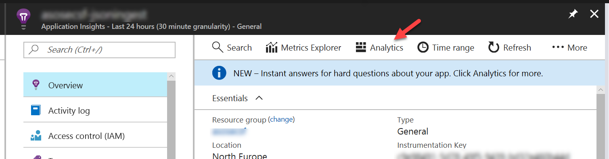
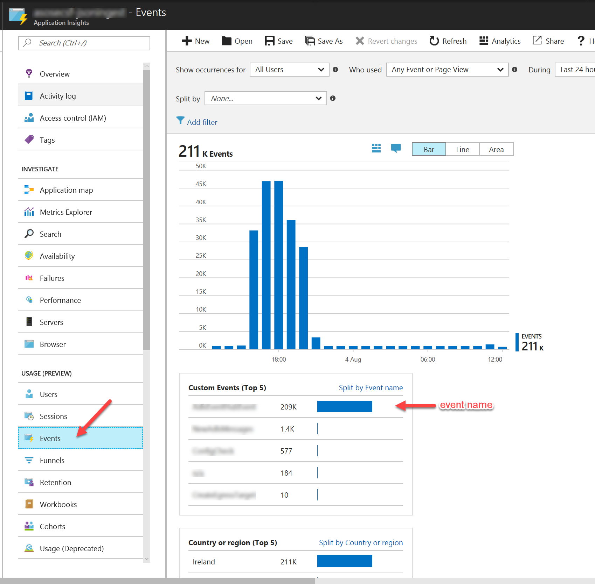

# Microsoft Azure AppInsights

All the calls to `log.Trace()` push trace events to AppInsights. Those are the events you can't directly see on main AppInsigts page but can access from **Analytics** tab:



The easiest way to get the events is to type a simple query in analytics:


`ILog` interface has a few extra methods which AppInsights package redirects to a proper location withing the account:

## Application Events

Application events help to report something important and distinct happening in your application. Events are logged by a call:

```csharp
log.Event("EventName", new Dictionary<string, object>
{
	{ "param1", someValue },
	{ "param2", someValue }
});
```

You can watch application events in the AppInsight account from the Events tab:




## Dependencies

Dependencies are external resources your application depends on. For instance, if you're calling to an external database this is a dependency. It's useful to track the dependency and know how long in takes to execute, which you can do with a following call:

```csharp
log.Dependency(
	"dependency type name",
	"dependency instance name",
	"operation name",
	TimeItTookInTicks);
```

You can see the dependencies on application map in AppInsights:


## Metrics

Metrics are a convenient way to track application metrics. For example, if you application fetches messages for a massive queue you might want to monitor how many messages there are in queue at a given moment of time.

```csharp
log.Metric("queue size", ElapsedTicks);
```

You can view metrics in the "Metric Explorer" tab in AppInsights.

## Requests

Requests are usually mapped to incoming requests for your application. For isntance, for web services that would become an incoming http request:

```csharp
log.Request("GetProducts", time.ElapsedTicks);
```
