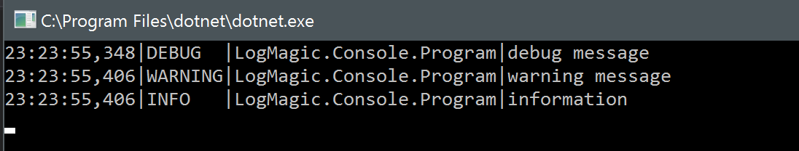
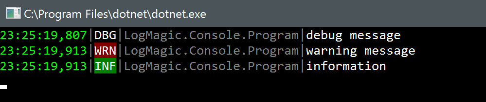

# List of known Writers and Enrichers

## Writers

### System Console

**Package**: built-in

**Syntax:**
```csharp
L.Config.WriteTo.Console();
```

Most basic write producing console output. By default it looks like this:



`.Console(string format)` overload allows custom formatting.

### Posh Console

**Package**: built-in

**Syntax:**
```csharp
L.Config.WriteTo.PoshConsole();
```

Colorful console writer. By default it looks like this:



`.PoshConsole(string format)` overload allows custom formatting.

### File on disk

**Package**: built-in

**Syntax:**
```csharp
L.Config.WriteTo.File("c:\\tmp\\my.log");
```

Writes logs to a file on disk specified in the first parameter. File is rolled every day and is always named as `name-YYYY-mm-dd.extension`. For example for the line above on December 19, 2016 the first file created immediately in `c:\tmp` folder will be `my-2016-12-19.log`, next day `my-2016-12-20.log` and so on. Time calculation is always performed in UTC and never local time.

`.File(string name, string format)` overload allows custom formatting.

### System trace

**Package**: built-in

**Syntax:**
```csharp
L.Config.WriteTo.Trace();
```
Writes events to `System.Diagnostics.Trace`. Note that it's only supported in `.NET 4.5` because at the moment `.NET Standard` doesn't have trace logging support.

`.Trace(string format)` overload allows custom formatting.

### Seq

**Package**: built-in

**Syntax:**
```csharp
L.Config.WriteTo.Seq("server address");
```
Writes events to the remote [Seq](https://getseq.net/) server. Seq is a great log collection and analysis framework.

`.Seq(string address, string apiKey)` overload allows passing an API key.

### Microsoft Azure AppInsights

**Package**: [LogMagic.Microsoft.Azure.ApplicationInsights](https://www.nuget.org/packages/LogMagic.Microsoft.Azure.ApplicationInsights/)

**Syntax:**
```csharp
L.Config.WriteTo.AzureApplicationInsights("app insights key", bool flushOnWrite = false);
```
Writes events [Azure AppInsights](https://azure.microsoft.com/en-us/services/application-insights/)

`flushOnWrite` parameter indicates whether to force a flush of events on each logging call. It's false by default and should only be set to true if you need an immediate submission as AppInsights caches events and submits in a batch periodically to achieve optimal performance. Note that settings this to true slows down logging dramatically.

Read [extended explanation](packages/azure-appinsights.md) how LogMagic integrates with AppInsights.

### Microsoft Service Fabric

**Package**: [LogMagic.Microsoft.Azure.ServiceFabric](https://www.nuget.org/packages/LogMagic.Microsoft.Azure.ServiceFabric/)

[Read more](packages/azure-servicefabric.md) on Azure Service Fabric integration.

## Built-In Enrichers

> todo

| Package     | Writer Syntax | Meaning        |
|-------------|---------------|----------------|
|  core       |  `.Constant()` | adds a constant value to every log event |
| core | `.MachineIp()` | current machine IP address |
| core | `.MachineName()` | current machine DNS name |
| core | `.MethodName()` | caller's method name |
| core | `.ThreadId()` | managed thread id |
