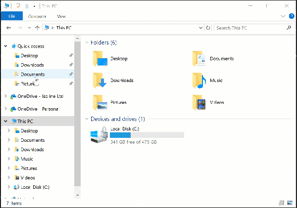
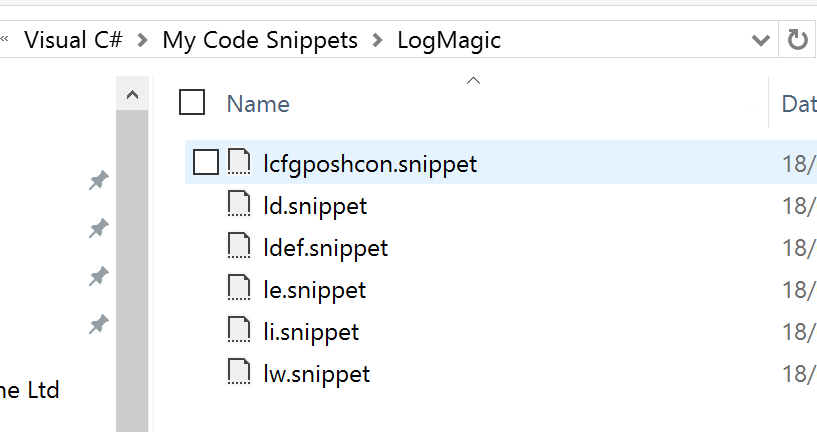
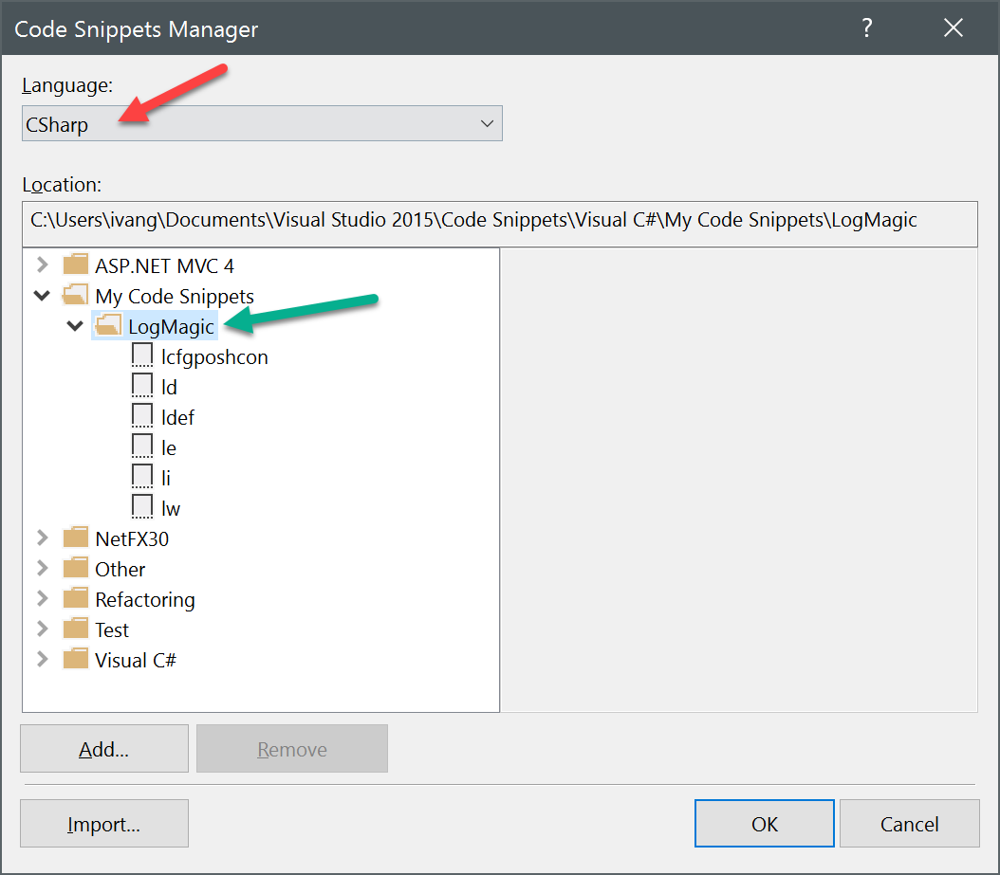

# Visual Studio Snippets

Since version 2.1.0 LogMagic doesn't support automatic installation of snippets into Visual Studio. We used to run a custom script on nuget package install stage which would copy snippet files inside VS well-known folder but that caused many problems with permissions, versioning, and at the end not everyone uses Visual Studio or even Windows these days for .NET development. Therefore this is a manual step now.

## Installing snippets

### Find snippets folder

Usually personal snippets reside in `%documents%\Visual Studio 2015\Code Snippets\Visual C#\My Code Snippets`. The folder location may vary depending on how you installed Visual Studio or it's version.

### Create a LogMagic subfolder in the snippets folder

Create any subfolder in the `My Code Snippets` folder, we recommend naming it `LogMagic` so you can find the stuff later.

### Copy snippets into the folder

Copy all the files from [vssnippets](https://github.com/aloneguid/logmagic/tree/master/src/vssnippets) into this folder and restart Visual Studio.

## Test snippets

You can test that Visual Studio has picked up the installed snippets by going to `Tools -> Code Snipped Manager`:

Also when you start typing the snipped and double-tab it will expand into the code region:

